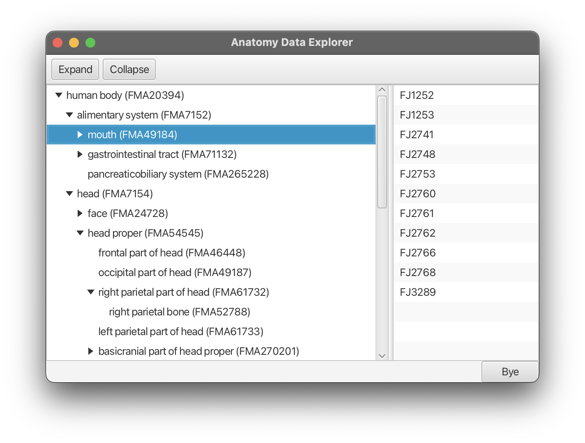
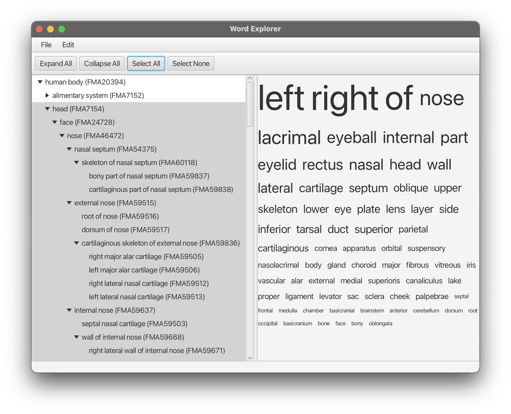
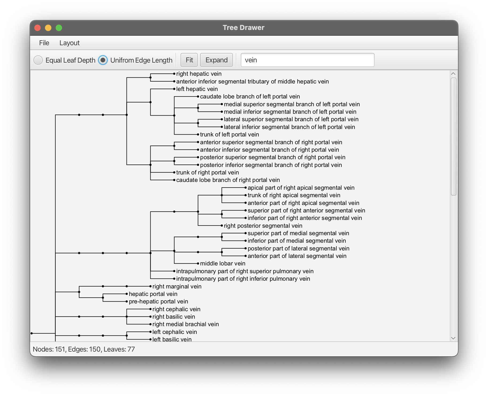
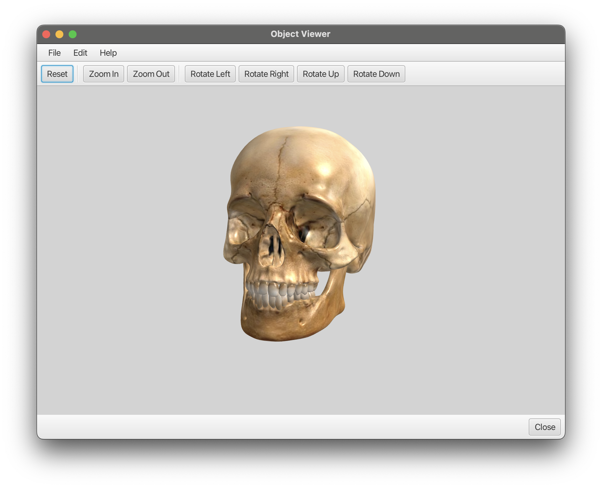
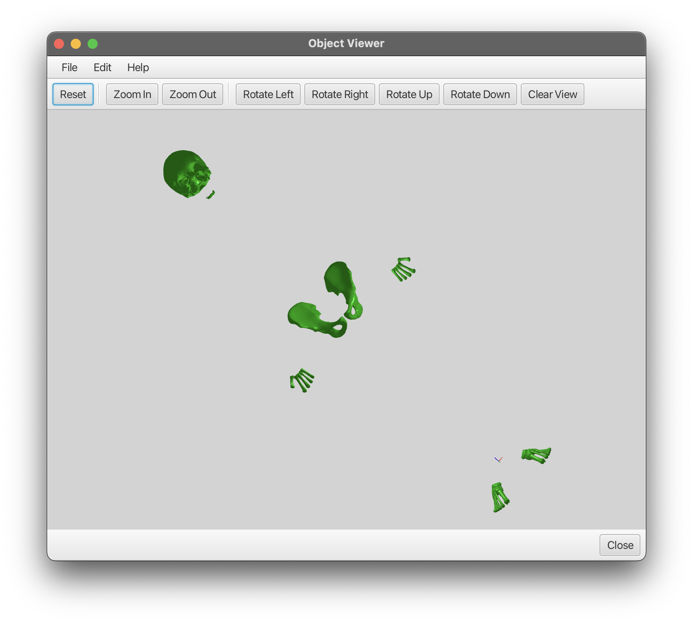

# Advanced Java Repository of Niklas M. Gerbes
Group: Luis Reimer, Niklas Gerbes

## Hand-in:
The assignment Hand-ins can be found in `src/main/java/`.
If any additional information is required to run the script for a specific assignment, 
those informations are fund in the READMEs of the respective assignments folders.

## Running assignment implementations:

### assignment01: ShowRelationsTree
see `src/main/java/assignment01/README_asgmt01.md`.

### assignment02: AnatomyDataExplorer
run: `cd assignemnts && mvn clean javafx:anatomyDaraExplorer`

### assignemnt03: WordExplorer
- run `mvn clean javafx:run@wordExplorer`
- for the written answers (scene-graph diagram & answer to task3.2) see the 
  `src/main/java/assignemnt03/README_asgmt03.md`

### assignment04: TreeDrawer
run `mvn clean javafx:run@treeDrawer`

### assignment05: ObjectViewer
- run `mvn clean javafx:run@objectViewer`
- Written answers at: `src/main/java/assignemnt05/README_asgmt05.md`

### assignment06: ObjectViewer6
- run `mvn clean javafx:run@objectViewer6`
- Written answers at: `src/main/java/assignemnt06/README_asgmt06.md`
