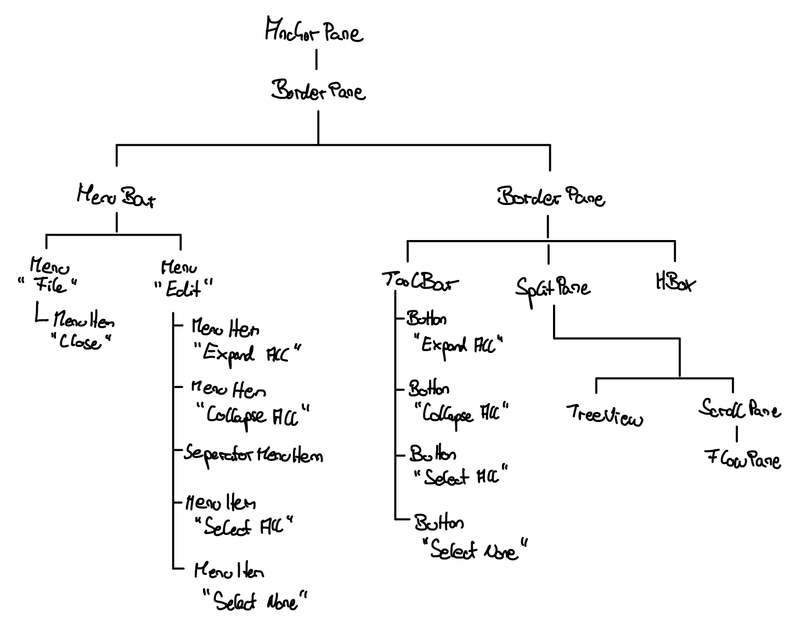

# Assignment 03 written answers:

### Task 1)

 Our Scene-graph looks like this:
 

### Task 3.2)
- Setting Hgap and Vgap to 10 ensures there is enough space between the individual Text 
nodes within the FlowPane. Without spacing, the words would appear too close or even concatenated, making 
the word cloud hard to read. A spacing of 10 creates visual clarity and improves the 
overall layout aesthetics.

- Enabling Fit to Width makes the FlowPane resize to the width of the ScrollPane. 
This prevents horizontal scrolling and ensures the word cloud wraps naturally to 
the next line. It improves readability and adapts better to window resizing or 
varying word lengths.